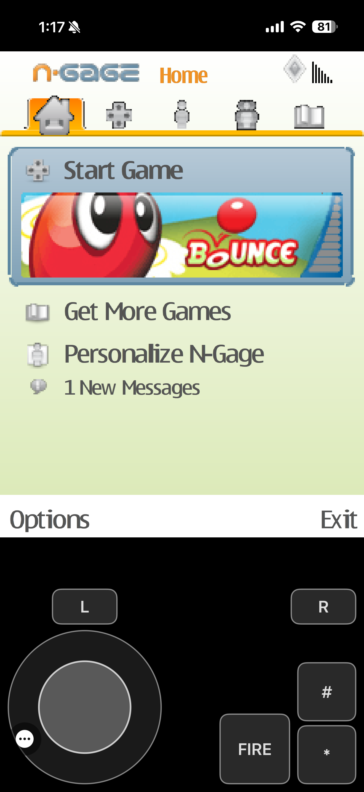
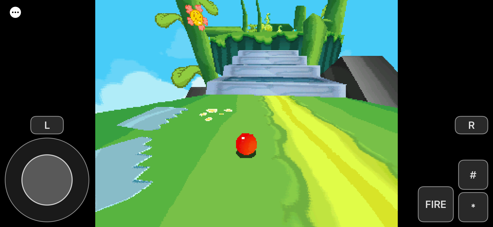
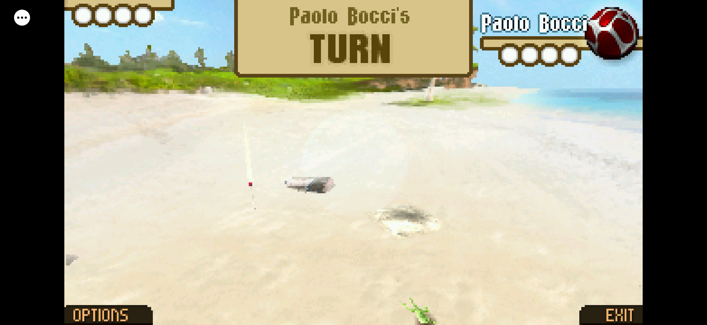
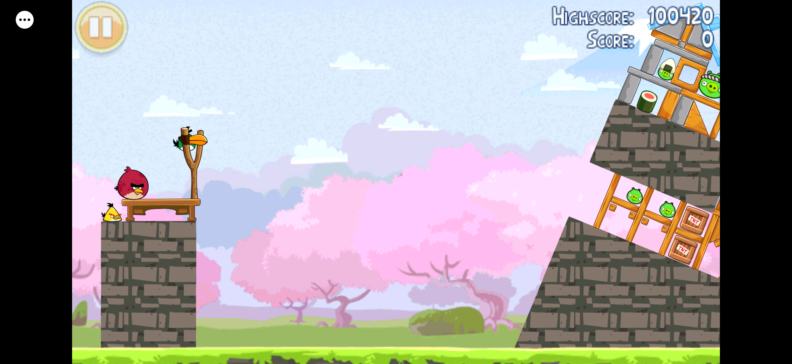

<div class="header">
  <p align="center">
     
     <!-- Margin not working for some reasons! Tried to fix it by searching but not working! Feel free to submit a patch! -->
     &nbsp;
     <!-- Old link: https://femto.pw/rasu.gif -->
     
  </p>

  <p align="center">
    <a href="https://github.com/EKA2L1/EKA2L1/actions?query=branch%3Amaster"></a>
    <a href="https://crowdin.com/project/eka2l1"></a>
  </p>

  <h3 align="center">An iOS port of the Symbian OS/N-Gage emulator EKA2L1</h3>
</div>

---

The emulator is JIT-less by defualt and works fully without needing a JIT-enabler. However if you want to enable JIT for better performance on CPU heavy titles, then you can enable it under Settings>CPU Backend. [More info in Q&A](#QA)

## Features
- **Full Keyboard and controller support, including navigating though the app list and pause screen**
- **Native UI with liquid glass**
- **iPad support**
- **Ability to install N-Gage games by simply going to "Settings>N-gage"**
- **iCloud progress sync across Apple devices** (needs a paid apple Developer account, or maybe we can upload it to the App Store someday 🥲) with **the ability to manually download and import a backups**
- **Joystick key Layout**
- **Per-game settings like Upscale Shaders and Render Resoltion implemented on iOS**
- **Gyroscope and haptic passthough support**
- **Auto scalable keylayouts based on aspect ratio, and more...**


### Installing (no build required, easiest)
1. Download **`EKA2L1.ipa`** from the [Releases section](https://github.com/MuhannadYT/EKA2L1_IOS/releases)
2. Sideload it with a tool that signs apps onto your device:
   - **[SideStore](https://sidestore.io/)** or **[AltStore](https://altstore.io/)** — import the
     `.ipa`; it re‑signs and installs it for your Apple ID. (This is the usual route.)
   - or any other sideloading/signing tool you already use.
   - Note: If using a websigner, enable "Match provisioning identifier" to fix file selection.
   - Thats it! If you need help installing a device and games, checkout [Quick start](https://eka2l1.github.io/quickstart/basic/installdevice/), [Important Links in the Wiki](https://eka2l1.miraheze.org/wiki/Important_Links),
For iOS questions see [Q&A](#QA).


### Screenshots (running on iOS)

N-Gage (5530)                                                   |  Bounce Boing Voyage                                                   
:--------------------------------------------------------------:|:-------------------------------------------------------------:
                           |   

The Big Roll in Paradise                                 | Angry Birds Seasons       
:-------------------------------------------------------:|:-----------------------------------------------------------------:
                 | 

### Q&A:
- How can I install a N-Gage Game?
  - Go to: Settings>N-Gage, and if you have a .n-gage file select it. The app will automatically copy it over. If you need more information check [How To Play N-Gage 2.0 Games - Wiki](https://eka2l1.miraheze.org/wiki/How_To_Play_N-Gage_2.0_Games)
- How can I change a device's langauge?
  - Click on "Devices", select your device, then select "Language".
- I'm getting a lot of micro cuts in a game, how can I fix that?
  - try closing and opening the game again, if this also doesn't work, you can try enabling jit.
- How can I enable JIT?
  - First, you must have a JIT enabler like, AltStore / SideStore / StikJIT, or a debugger. You can turn on JIT by going to Settings>CPU Backend>JIT. 

## Building from source

Requirements: **macOS** with full **Xcode** (the Liquid‑Glass app icon needs **Xcode 26+**) and
**CMake 3.x** (`build_ios.sh` fetches 3.31.6 for you).

```sh
git clone --recursive https://github.com/MuhannadYT/EKA2L1_IOS EKA2L1      # --recursive: the core pulls ~35 submodules
cd EKA2L1
export DEVELOPER_DIR=/Applications/Xcode.app/Contents/Developer
```

### Simulator
```sh
./build_ios.sh                 # configures + builds build-ios/ for the iphonesimulator SDK
# install + launch on a booted simulator:
xcrun simctl install booted build-ios/src/emu/ios/eka2l1.app
xcrun simctl launch  booted com.eka2l1.emulator
```

### Real device - building and installing it on your iPhone/iPad
The device build targets the `iphoneos` SDK and **defaults to the `dyncom` interpreter**, so it needs
only ordinary development signing, **no special `allow-jit` entitlement**.

1. **Cross‑compile FFmpeg for the device** (one‑time):
   ```sh
   ( cd src/external/ffmpeg && ./build-ios-device.sh )
   ```
2. **Configure + build** the app (use the CMake 3.x that `build_ios.sh` cached under
   `~/Library/Caches/eka2l1-ios/…`):
   ```sh
   cmake -S . -B build-ios-device -G Ninja \
       -DCMAKE_SYSTEM_NAME=iOS \
       -DCMAKE_OSX_SYSROOT=iphoneos \
       -DCMAKE_OSX_ARCHITECTURES=arm64 \
       -DCMAKE_OSX_DEPLOYMENT_TARGET=15.0 \
       -DCMAKE_BUILD_TYPE=RelWithDebInfo
   cmake --build build-ios-device --target eka2l1 -j"$(sysctl -n hw.logicalcpu)"
   ```
3. **Install it.** Easiest is to package an unsigned `.ipa` and sideload it exactly like the prebuilt
   one (SideStore/AltStore signs it for you):
   ```sh
   APP=build-ios-device/src/emu/ios/eka2l1.app
   rm -rf Payload && mkdir Payload && cp -R "$APP" Payload
   zip -qry EKA2L1.ipa Payload          # then import EKA2L1.ipa into SideStore/AltStore
   ```
   Or sign it yourself with a free Apple ID profile and install over USB:
   ```sh
   codesign --force --sign <Apple Development cert> --entitlements <ent.plist> --timestamp=none "$APP"
   xcrun devicectl device install app --device <device-id> "$APP"
   ```
   On first launch, trust the developer cert: *Settings → General → VPN & Device Management*.

---

### Compatibility:
- At the moment the emulator supports:
    - Almost all official N-Gage/N-Gage 2.0 official libraries
    - Most of Symbian's game libraries from S60v1 to Symbian Belle
    - A limited subsets of Symbian applications.

- Compatibility for the games and software that can (and can't) run on the emulator can be verified [**here**](https://github.com/EKA2L1/Compatibility-List)

### Links

For more information, discussion and support, please visit these links:

- [**Homepage**](https://eka2l1.github.io/)
- [**Emulator Wiki**](https://eka2l1.miraheze.org/wiki/Main_Page)
- [**Discord server**](https://discord.gg/5Bm5SJ9)

### Donations

From 2022, developing the emulator has shifted to become a part-time hobby and sometimes not actively maintained in months, since the compatibility for most popular games and Symbian operating systems have been satisfied.

Still, if you feel like our work has benefited you much and you want to support or give us some cheers, feel free to donate to two developers that maintain the PC/Android version by visiting the **Sponsor this project** section of the Github page.

Visit this [link](https://eka2l1.github.io/quickstart/donation/) for more information.

  -------------
 *GIFs are provided by [**Stranno**](https://www.youtube.com/user/9esferas1)!*
 
 *Logo is designed and drawn by dmolina007 and Frenesi ❤️ Modified for iOS by MuhannadYT ❤️*
